# Платформа для обмена навыками и услугами

Добро пожаловать в репозиторий проекта «Платформа для обмена навыками и услугами». Этот проект предназначен для создания удобной и безопасной платформы, на которой пользователи могут обмениваться знаниями и услугами.

---

## План проекта

1. **Определение функциональности приложения**  
   Анализ требований и составление перечня основных функций.
2. **Проектирование**  
   Разработка архитектуры приложения и структуры базы данных.
3. **Безопасность и аутентификация**  
   Реализация механизмов безопасности с использованием Spring Security.
4. **Реализация бизнес-логики**  
   Программирование основных функциональных модулей и интеграция компонентов.
5. **Тестирование**  
   Проведение модульного, интеграционного и функционального тестирования с использованием JUnit.

---

## Технологический стек

- **Java 21**
- **Spring Boot**
- **Spring Security**
- **Spring Data**
- **Spring Web**
- **Maven**
- **Spring Validation**
- **PostgreSQL**
- **Docker**
- **JUnit**

---

## Структура базы данных

Ниже представлена схема базы данных, отражающая основные сущности и их взаимосвязи:

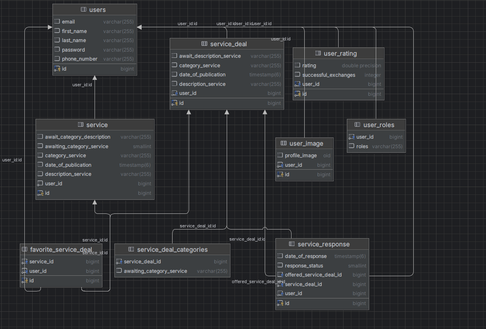


---

## Запуск проекта
   ```bash
   cd docker
   docker-compose up --build
   ```

---

## Демонстрация сайта (бэк + фронт)

1. Форма регистрации 

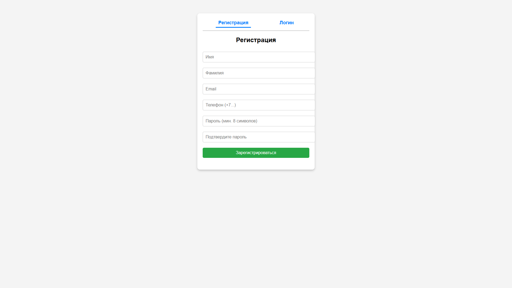

2. Форма авторизации

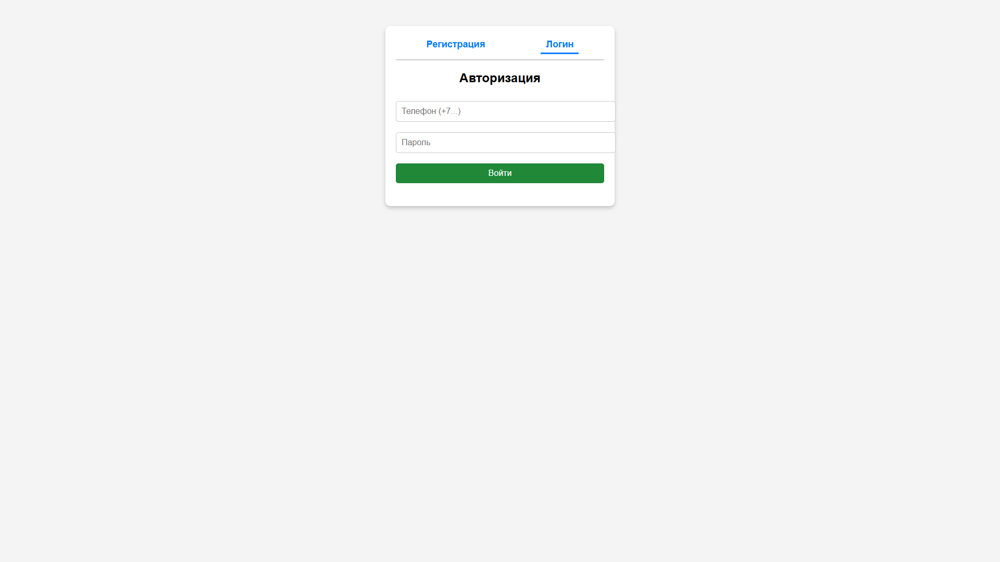

3. Создание услуги

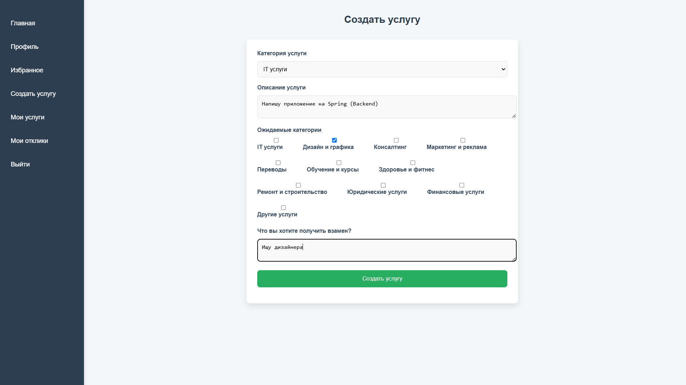

4. Поиск услуги

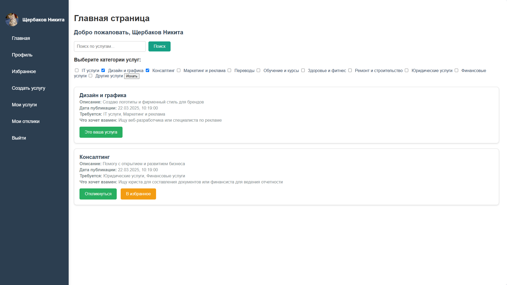

5. Избранное

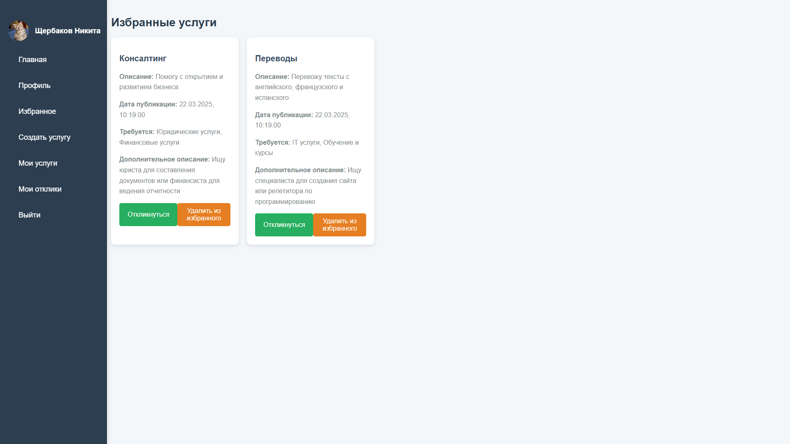

5. Мои услуги
   
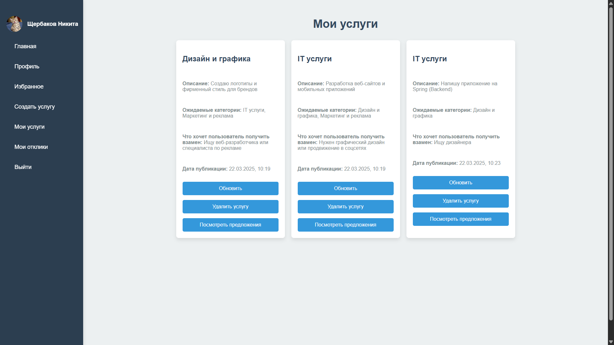

6. Отклик 

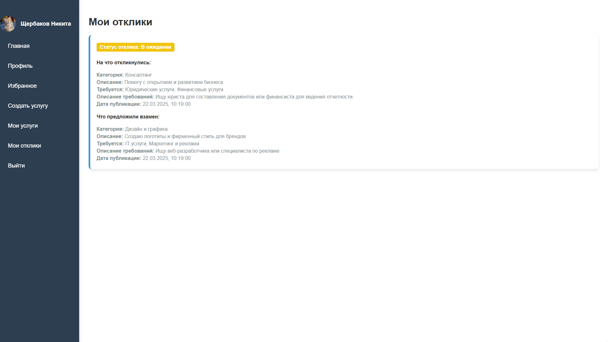

7. Ответ на услугу

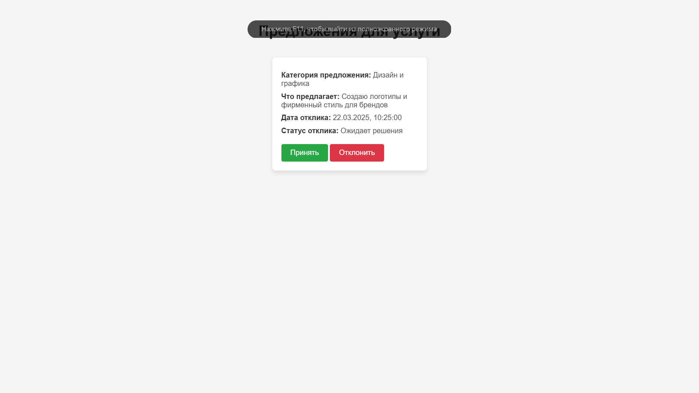

8. Обновленная услуга

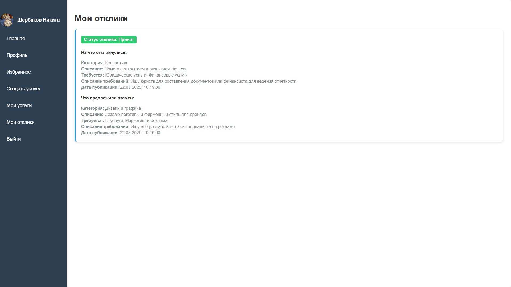

9. Уведомления на почту

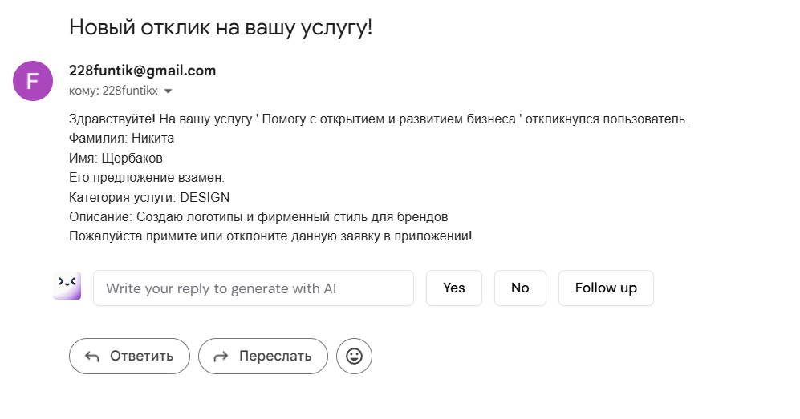
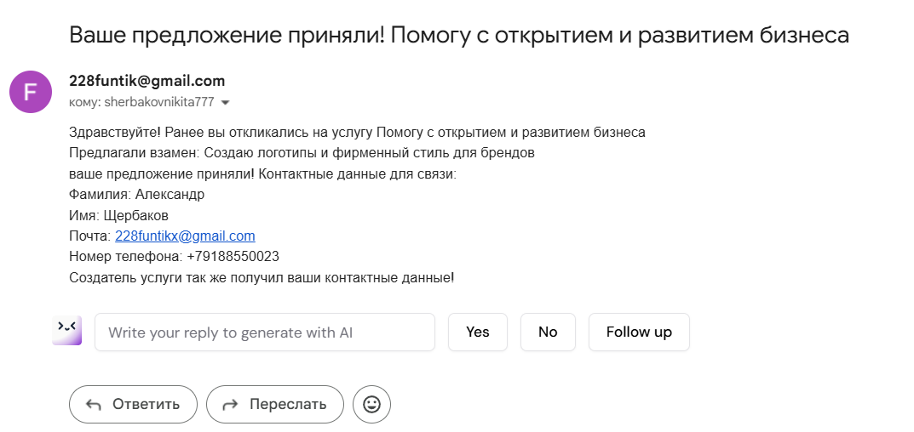
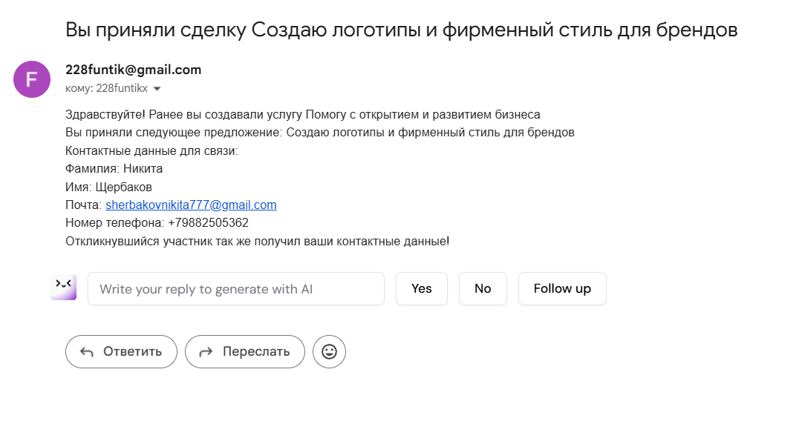


**[Ссылка на фронт](https://github.com/Funtikz/FrontSber)**